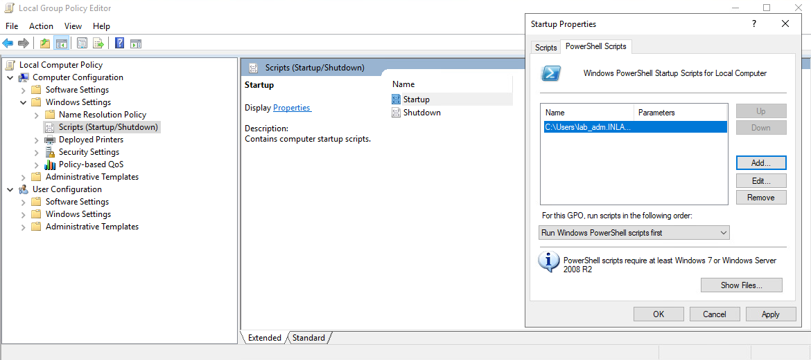
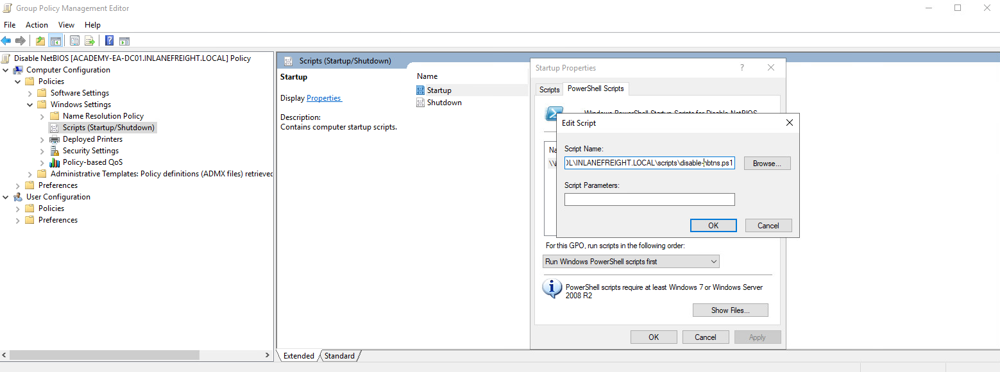

LLMNR-NBT-NS Poisoning - from Windows
#####################################

Date: 2024-12-20 08:17:07

Status: #new

Tags: :ref:`Active Directory Enumeration Attacks`

----

Description
*************
If your client provides a Windows box as your attack host you can use Inveigh 
to run responder like captures.

Inveigh Overview
*************************

:ref:`inveigh` 

Remediation
**************

A remediation recommendation to the client would be to disable LLMNR in the group policy locations at:

`Computer Configuration --> Administrative Templates --> Network --> DNS`

And enabling "Turn OFF Multicast Name Resolution".  Please note, that this is a significant change, and 
should be tested completely and understanding the impact before rolling this out fully.

NBT-NS cannot be disabled via Group Policy but must be disabled locally on each host. We can do this by opening Network and Sharing Center under Control Panel, clicking on Change adapter settings, right-clicking on the adapter to view its properties, selecting Internet Protocol Version 4 (TCP/IPv4), and clicking the Properties button, then clicking on Advanced and selecting the WINS tab and finally selecting Disable NetBIOS over TCP/IP.

Performing this on every host can be time consuming, but you can automate it with a powershell script:

.. code-block:: powershell

    $regkey = "HKLM:SYSTEM\CurrentControlSet\services\NetBT\Parameters\Interfaces"
    Get-ChildItem $regkey |foreach { Set-ItemProperty -Path "$regkey\$($_.pschildname)" -Name NetbiosOptions -Value 2 -Verbose}

In the Local Group Policy Editor, we will need to double click on Startup, choose the PowerShell Scripts tab, and select "For this GPO, run scripts in the following order" to Run Windows PowerShell scripts first, and then click on Add and choose the script. For these changes to occur, we would have to either reboot the target system or restart the network adapter.

   
To push this out to all hosts in a domain, we could create a GPO using Group Policy Management on the Domain Controller and host the script on the SYSVOL share in the scripts folder and then call it via its UNC path such as:

\\inlanefreight.local\SYSVOL\INLANEFREIGHT.LOCAL\scripts

Once the GPO is applied to specific OUs and those hosts are restarted, the script will run at the next reboot and disable NBT-NS, provided that the script still exists on the SYSVOL share and is accessible by the host over the network.

Other mitigations include filtering network traffic to block LLMNR/NetBIOS traffic and enabling SMB Signing to prevent NTLM relay attacks. Network intrusion detection and prevention systems can also be used to mitigate this activity, while network segmentation can be used to isolate hosts that require LLMNR or NetBIOS enabled to operate correctly.

Detection 
**********

It is not always possible to disable LLMNR and NBT-NS, but we can monitor for 
attacks, and implement an active strategy.  Please refer to this (https://www.praetorian.com/blog/a-simple-and-effective-way-to-detect-broadcast-name-resolution-poisoning-bnrp/) for this method.

Hosts can also be monitored for traffic on UDP 5355 and 137 for even IDs 

4697 (https://docs.microsoft.com/en-us/windows/security/threat-protection/auditing/event-4697)
7045 (https://www.manageengine.com/products/active-directory-audit/kb/system-events/event-id-7045.html)

We can also monitor to ensure that LLMNR has not been re-enabled after disabled in the registry key:
`HKLM\Software\Policies\Microsoft\Windows NT\DNSClient` for the `EnableMulticast` DWORD ( 0 means it is disabled)

References
************
https://academy.hackthebox.com/module/143/section/1420