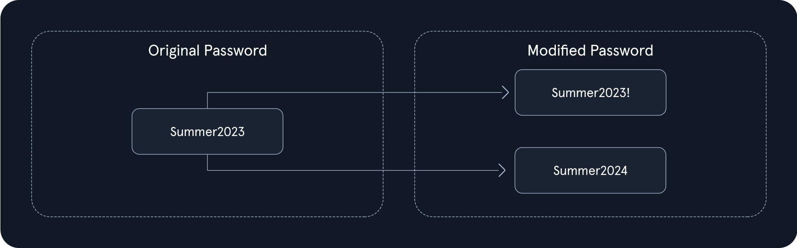
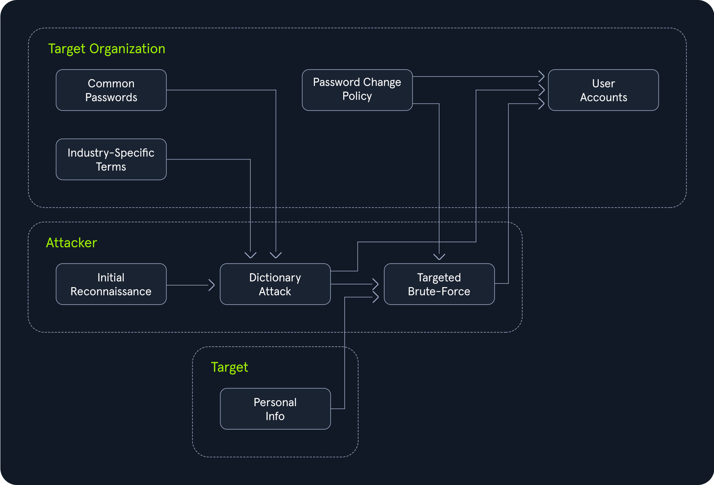
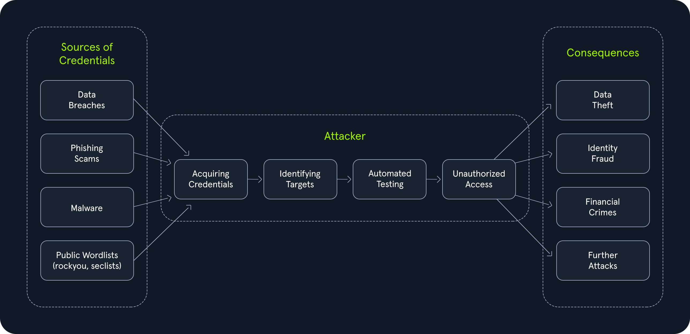

Hybrid Attacks
###############

Date: 2025-01-11 12:59:27

Status: #draft 

Tags: :ref:`certified penetration tester`, :ref:`login brute forcing`

----

User behavior will likely perform this on a password change req requirement:

This behavior opens up the target for a Hybrid attack: 

    

Creating a Hybrid list by Password Policy
*******************************************

If for example you know the policy to be: 

- min length 8 
- At least one lowercase letter
- At least one number 

By pairing grep with a large password list we can start curating our own list that excludes passwords that do not qualify.

Example: 

Lets start with the large list darkweb2017-top10000.txt and download it.

.. code-block:: bash

    Temen@htb[/htb]$ wget https://raw.githubusercontent.com/danielmiessler/SecLists/refs/heads/master/Passwords/darkweb2017-top10000.txt

And by using grep we can curate the list to a new list:

.. code-block:: bash

    Temen@htb[/htb]$ grep -E '^.{8,}$' darkweb2017-top10000.txt > darkweb2017-minlength.txt

Then filter words that has an uppercase 

.. code-block:: bash

    Temen@htb[/htb]$ grep -E '[A-Z]' darkweb2017-minlength.txt > darkweb2017-uppercase.txt

Then finally lowercase words 

.. code-block:: bash

    Temen@htb[/htb]$ grep -E '[a-z]' darkweb2017-uppercase.txt > darkweb2017-lowercase.txt

Then filter again for words that have at least one number 

.. code-block:: bash

    Temen@htb[/htb]$ grep -E '[0-9]' darkweb2017-lowercase.txt > darkweb2017-number.txt

After all this filtering chaining we now have a list from 10000 to 89

Credential Stuffing: Leveraging Stolen Data for Unauthorized Access
**********************************************************************

Users often re-use passwords across numerous services 

