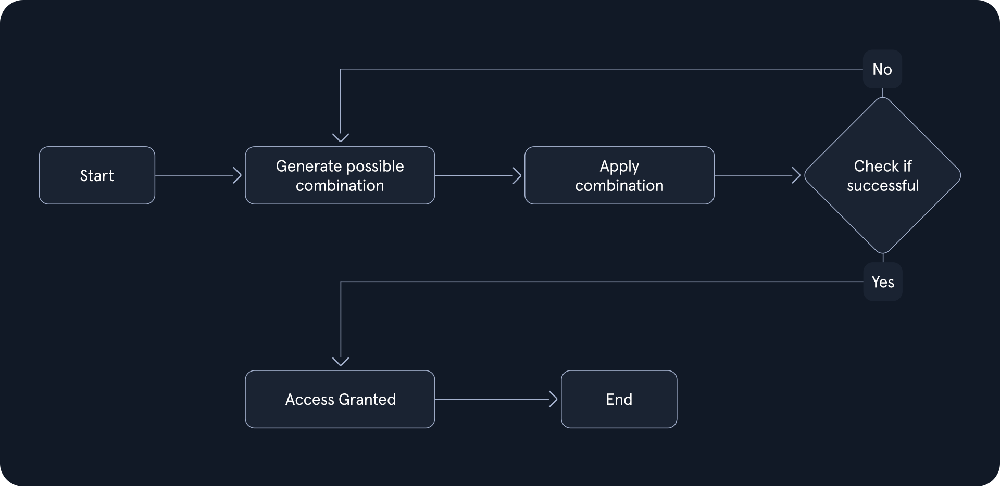

Login Brute Forcing
######################

Date: 2025-01-10 13:30:39

Status: #draft 

Tags: :ref:`certified penetration tester`

----

Introduction
**************

Brute forcing is the trial and error attempting of passwords.  The chance of success is dependant on: 

- Password complexity: Length, mix chars upper case lower case etc... 
- Computational Power: The speed in which the attacker can execute successive attacks  
- Security Measures: CAPTCHAs, MFA, lockouts, IP restrictions,  behavior 

.. toctree::
   :maxdepth: 1
   :caption: Login Brute Forcing

   Types of Brute Force attacks 
   Password Security Fundamentals 
   Brute Force Attacks
   Dictionary Attacks
   Hybrid Attacks
   ../../tags/hydra
   ../../tags/medusa
   Custom Wordlists
   

