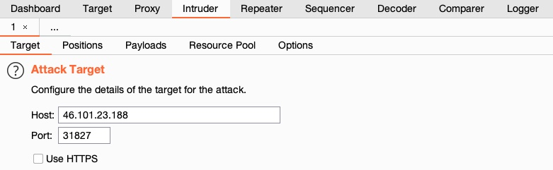
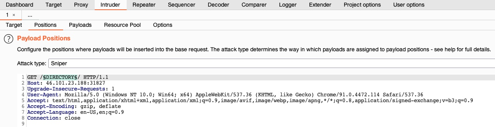

Burp Intruder
##############

Date: 2025-01-09 16:18:59

Status: #draft

Tags: :ref:`certified penetration tester`, :ref:`using web proxies`

----

Description
***************

Burp has other functions aside from a web proxy.  It also has:

- Web Fuzzers
- Web Scanners

Add this to fuzzing apps like: 
- :ref:`ffuf` 
- :ref:`dirbuster`
- :ref:`gobuster`
- :ref:`wfuzz`

.. note:: This community version is throttled at 1 request per second.  Use command line tools if you do not have the pro version

Usage
******

Target
==========

Find your request in the history section and either:

- Right click and choose send to `intruder`
- Press CTRL+Shift+I 

Positions
==========

click the position where you want to fuzz at and  click the  `§ button` and add a pointer name

Payloads
=========

On the payload section there are a number of options:

- Payload Sets
- Payload Options
- Payload Processing
- Payload Encoding

References
***********

https://academy.hackthebox.com/module/110/section/1054

