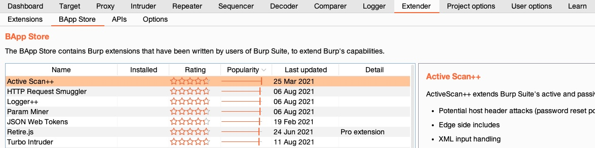
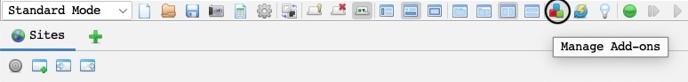

Extensions
############

Date: 2025-01-10 11:22:42

Status: #draft 

Tags: :ref:`certified penetration tester`, :ref:`using web proxies`

----

Description 
*************

Both :ref:`zap` and :ref:`burp` have the ability to download and use extensions. 

- Burp has the BApp Store (https://portswigger.net/bappstore)
- Zap has the ZAP Marketplace (https://www.zaproxy.org/addons/)

BApp Store 
*************

In burp suite, click the extension tab, and then select the BApp Store sub-tab

ZAP Marketplace
****************

In ZAP click on the Marketplace Icon 

References
**********

https://academy.hackthebox.com/module/110/section/1104