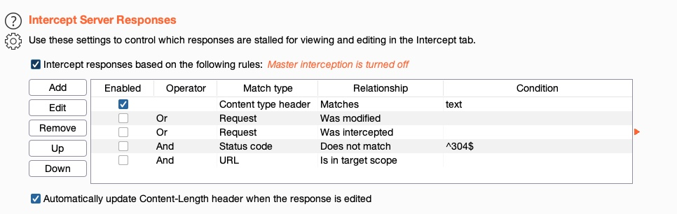

Intercepting Responses
#########################

Date: 2025-01-09 13:43:08

Status: #draft

Tags: :ref:`certified penetration tester`, :ref:`using web proxies`

----

Description
**************
There are situations where you may want to filter the response.  For example hide a certain element to aid in your testing. 

Filtering in :ref:`burp suite`
********************************

In Burp, we can enable response interception by going to (Proxy>Options) and enabling Intercept Response under Intercept Server Responses:

Now when you refresh the page, you can modify the source, then forward it back to the browser for the intended result.

- modify client side controls
- Hide sections 

Filtering in :ref:`owasp-zap`
********************************

Zap does this function automatically, and you just need to step forward to display the result.

References 
************

https://academy.hackthebox.com/module/110/section/1049
